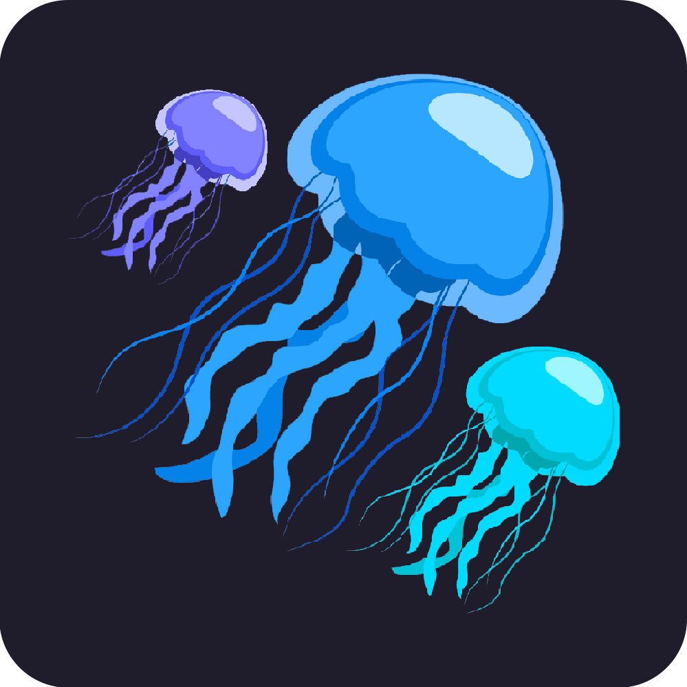
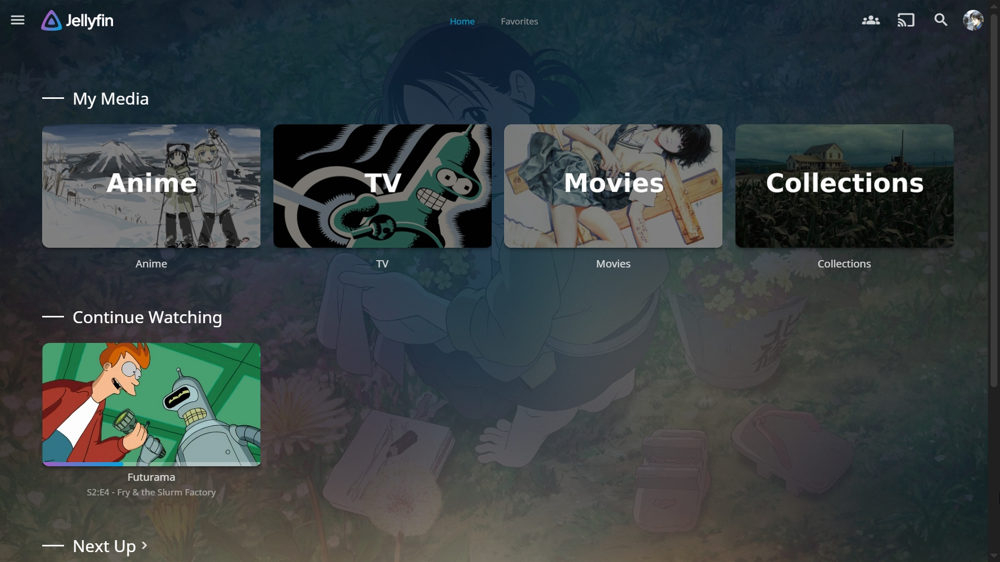
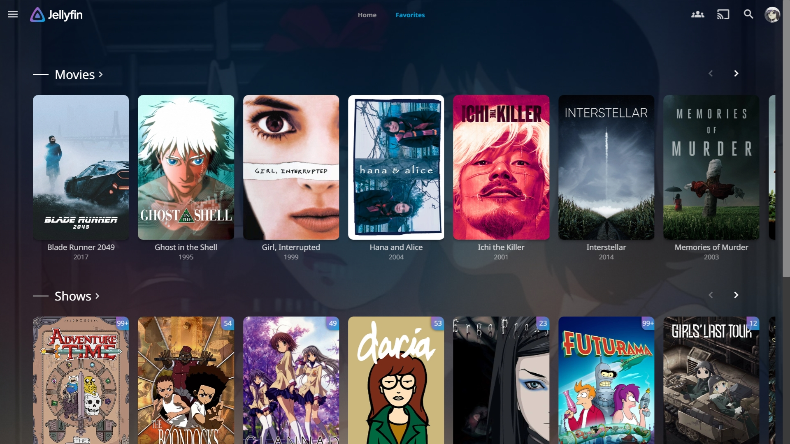
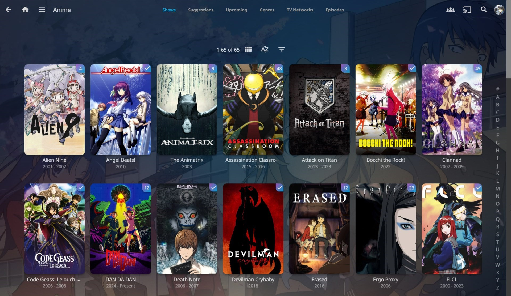
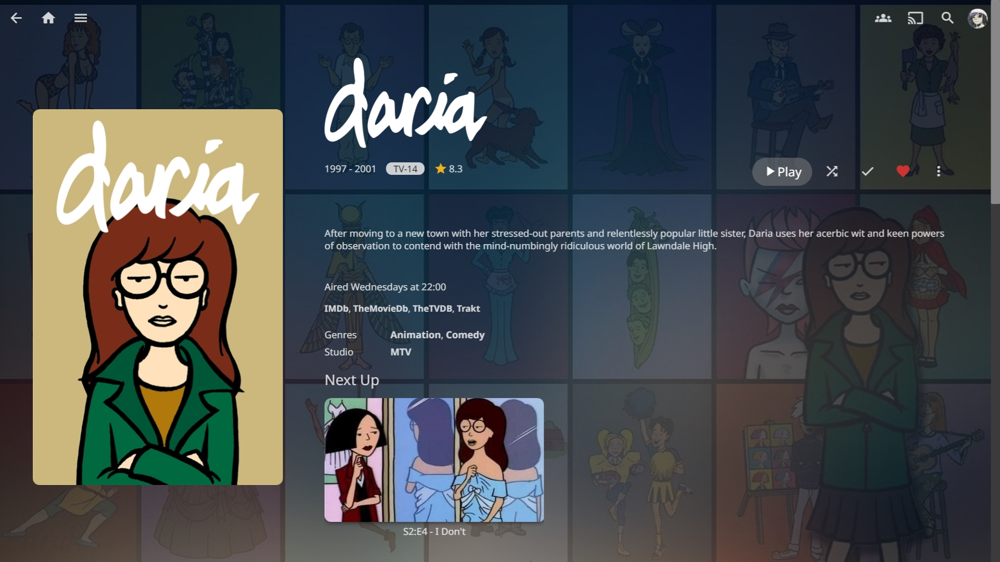
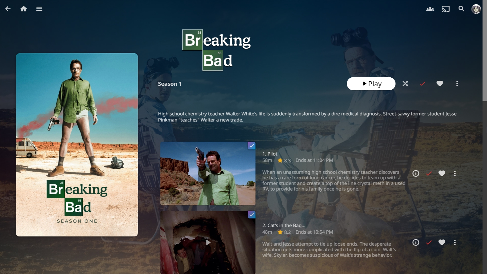
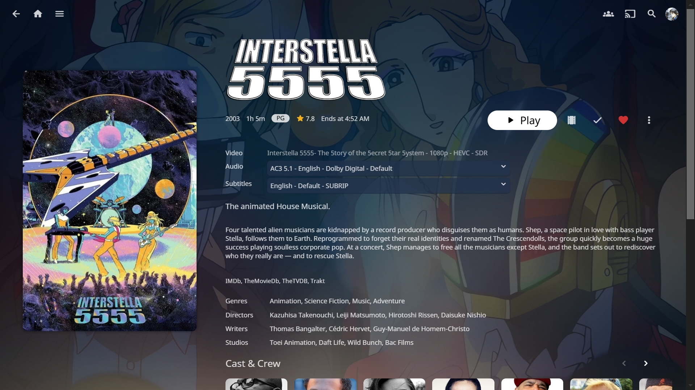
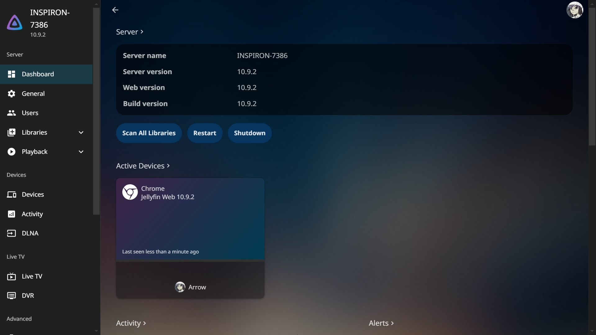
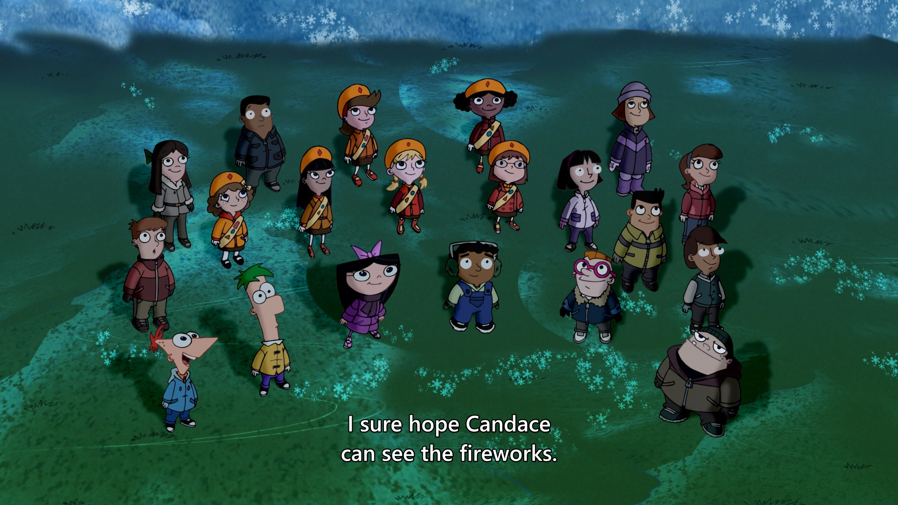

# Medusa - A modern CSS theme for Jellyfin


### Home





## Usage
Dashboard -> General -> Custom CSS code:
```
@import url("https://cdn.jsdelivr.net/gh/Arrow420/Medusa@main/Medusa.css");
```


### Library



### Details Page







### Dashboard



------------------------------
### Custom Subtitle styling for Jellyfin Media Player

Paste into "Settings -> Client Settings -> Other - Manual MPV Configuration":
```
sub-font="Segoe UI Semibold"
sub-font-size=38
sub-color="#FFFFFF"
sub-border-size=1.2
sub-shadow-offset=0.2
sub-margin-x=180
sub-margin-y=42
sub-color="#FFFFFF"
sub-border-color="#000000"
sub-shadow-color="#000000"
sub-fix-timing=no
stretch-image-subs-to-screen=no
sub-filter-sdh=yes
sub-filter-sdh-harder=yes
sub-filter-regex-enable=yes
sub-filter-jsre=opensubtitles|addic7ed|subscene|(English - US - SDH)|dreaMaker7|(sync.+?corrected by)|(www\.tvsubtitles\.net)
sub-ass-force-margins=yes
sub-use-margins=no
sub-gray=yes
```
